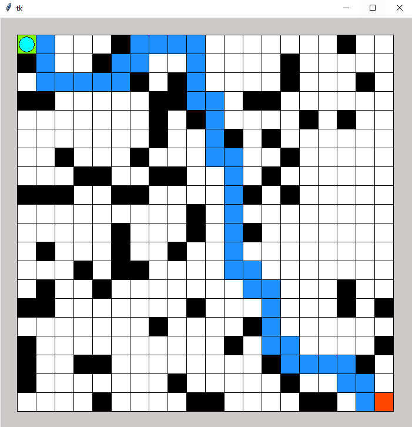

# Optimal Path Finding in a GridWorld
----
Many real life applications such as **Intelligent Transportation System, Robot Navigation and Internet Routing** can function efficiently when an optimal path between any two points is provided. Path finding algorithms are used to find optimal paths between two nodes in a graph like environment. In this project, various algorithms from different domains are evaluated and compared to find optimal path for traversal in a simulated grid world environment with obstacles.

Optimal path finding can be implemented using various State-of-the-art algorithms like ***Breadth-First-Search (BFS), Depth-First-Search (DFS), A-Star (A*), Dijkstra’s algorithm etc.** In this paper we have implemented different classes of algorithm with different constraints. The first algorithm is A-Star which is an informed search algorithm. The second is ***Genetic algorithm (GA),*** which is based on meta-heuristics and improves the results based on the previous iterations. The third implementation is ***Q-learning and State Action Reward State Action (SARSA)*** algorithms which are part of Reinforcement Learning. These algorithms are based on an agent learning the environment by getting feedback on its actions.

The environment is a grid world which is de_ned by a sizeM, a start position, a destination and random obstacles. The grid dimensions can be unequal (MxN) but to get an idea of the grid size we have used square grids, where a grid of size M will have dimensions ***MxM*** with the start position on the top left and the destination on the bottom right. The obstacles can be either pre-de_ned or randomly placed such that there isn't an obvious direct path between the start and end positions. For the experiments we have used random obstacles with 20.5% obstacle density. Having low or high density gives straight forward answers, since there are usually straight paths with less obstacles and limited number of paths with more obstacles.

### Steps to be followed to run various algorithms to find the optimal path:
----
This Project code is available in the root folder of the project repository. 
##### Pre-requisites: 
- Install Python
- Insatll dependencies like ***tkinter, matplotlib.pyplot, scipy.ndimage.filters, pylab***
##### Algorithms Execution: 
- Run A-Star Algorithm by going to main folder and executing below command in command prompt.
    ```
    python RunAStar.py
    ```
- Run Genetic Algorithm by going to main folder and executing below command in command prompt.
    ```
    python RunGenetic.py
    ```
- Run Q-Learning Algorithm by going to main folder and executing below command in command prompt.
    ```
    python  RunRL.py
    ```
- Run SARSA Algorithm by going to main folder and executing below command in command prompt.
    ```
    python  RunSARSA.py
    ```
##### Results evaluation
- Results can be seen in the Grid as shown below and also can be evaluated in graphs.
<p align="center">
  
</p>

### Contributions
----
- The main contributors for this project are **Ashwin Sundareswaran R, Kavya Bhadre Gowda, Shubhanghi Kukreti, Chaudhary Guroosh Gabriel Singh.** Find the contribution details under ***"Report and Reference Documents"*** folder ***Readme file***.
### Todos
----
 - Algorithms can be evaluated for variousgrid sizes by making changes in grid and the various parameters affecting individual algorithms.

### License
----
Contributions are welcomed.
